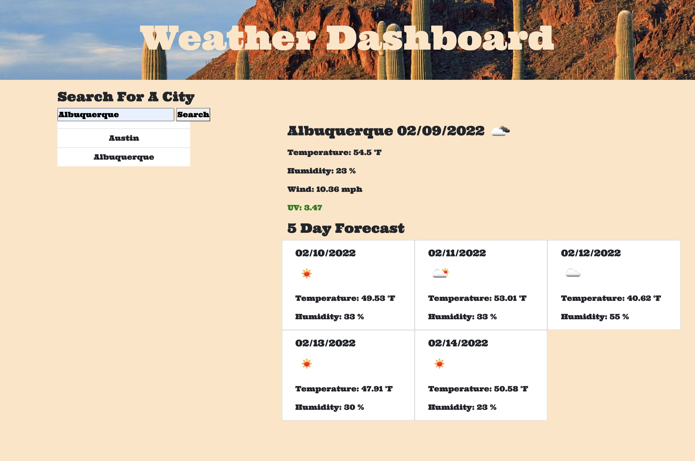

# Weather Dashboard (with 5 Day Weather Forecast)

## Description
Weather Dashboard application to ensure that you never step out of the house in less than comfortable attire!

## Table of Contents

- [Usage](#usage)
- [Visuals](#visuals) 
- [Credits](#credits) 
- [Links](#links)

## Usage
Visit page and input desired city to access their current weather and 5 days to follow!

## Visuals

## Credits
Credit to class activites, my tutor, Queen Shabazz, and my peers! Also credit to OpenWeatherMap API: https://openweathermap.org/api/one-call-api.

## Links

- GitHub Repository
    - https://github.com/giovannaruggio/weather-dashboard
- Deployed App
    - https://giovannaruggio.github.io/weather-dashboard/
    

